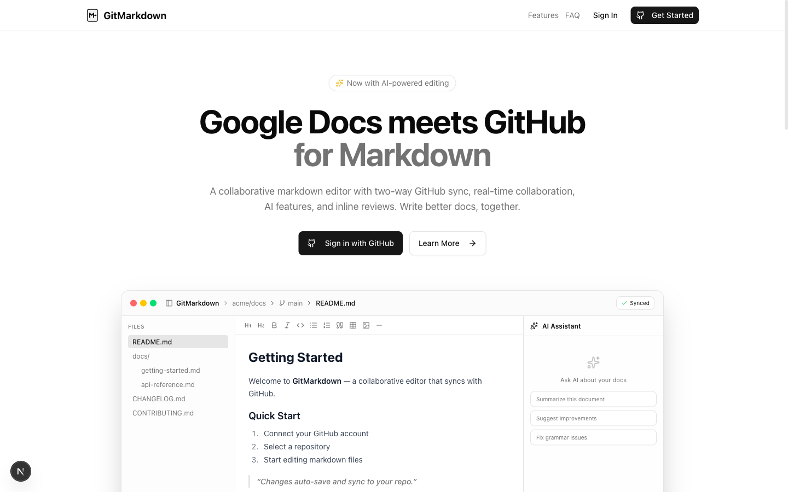
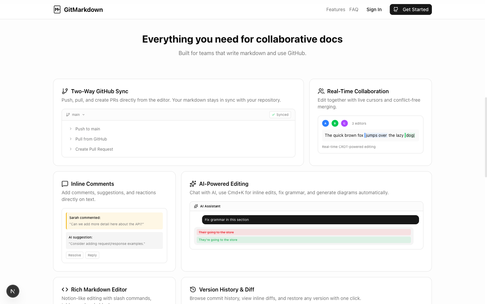

# GitMarkdown

[](LICENSE)
[](https://nextjs.org)
[](https://typescriptlang.org)

A collaborative markdown editor with two-way GitHub sync, real-time collaboration, and AI-powered editing.



## Overview

GitMarkdown is a web-based markdown editor that integrates with GitHub repositories. Edit markdown files with a rich WYSIWYG interface, collaborate in real-time, and sync changes directly to GitHub. Built with Next.js 16 and Tiptap v3.

## Features

**Editor** - Tiptap v3 WYSIWYG with slash commands, bubble menu, syntax highlighting, tables, task lists, and full GFM support.

**GitHub Integration** - Two-way sync, branch management, PR creation, version history with inline diffs, and PR comment sync.

**Collaboration** - Yjs CRDT-based real-time editing with cursor tracking, presence indicators, inline comments, and reactions.

**AI** - Chat sidebar, inline editing (Ctrl+K), mermaid diagram generation, custom personas, and multi-provider support (Anthropic Claude, OpenAI).

**Document Management** - File tree with drag-and-drop, multi-tab editing, template gallery, table of contents, zip export, and find & replace.

**Developer Experience** - Command palette (Cmd+K), keyboard shortcuts, writing checks, code viewer with syntax highlighting, and BYOK AI keys.



## Quick Start

> For a full walkthrough, see the **[Setup Guide](docs/SETUP.md)**.

### Prerequisites

- Node.js 20+
- A GitHub account
- A Firebase project (free Spark plan works)
- An Anthropic and/or OpenAI API key (for AI features)

### Install

```bash
git clone https://github.com/pooriaarab/gitmarkdown.git
cd gitmarkdown
npm install
cp .env.example .env.local
# Fill in your credentials (see below)
npm run dev
```

Open [http://localhost:3000](http://localhost:3000).

### Firebase Setup

1. Create a project at [Firebase Console](https://console.firebase.google.com/)
2. **Register a Web App** (Project Settings > General > Add app > Web) - copy config to `.env.local`
3. **Enable Authentication** (Build > Authentication > Sign-in method > GitHub)
4. **Enable Cloud Firestore** (Build > Firestore Database > Create database > Start in test mode)
5. **Enable Realtime Database** (Build > Realtime Database > Create Database) - copy the URL to `NEXT_PUBLIC_FIREBASE_DATABASE_URL`
6. **Generate Admin SDK key** (Project Settings > Service Accounts > Generate new private key) - copy `project_id`, `client_email`, `private_key` to `.env.local`
7. **Apply security rules** - see [Security Rules](#security-rules)

### GitHub OAuth Setup

1. Go to [GitHub Developer Settings > OAuth Apps > New](https://github.com/settings/applications/new)
2. Set:
   - **Homepage URL**: `http://localhost:3000`
   - **Callback URL**: `https://<YOUR_FIREBASE_PROJECT_ID>.firebaseapp.com/__/auth/handler`
3. Copy the **Client ID** and **Client Secret** to both `.env.local` and Firebase Console > Authentication > Sign-in method > GitHub

### AI Provider Keys

At least one is required for AI features:

- **Anthropic**: [console.anthropic.com](https://console.anthropic.com/settings/keys) -> `ANTHROPIC_API_KEY`
- **OpenAI**: [platform.openai.com](https://platform.openai.com/api-keys) -> `OPENAI_API_KEY`

### Environment Variables

See [`.env.example`](.env.example) for the full list with inline comments.

| Variable | Description | Required |
|----------|-------------|----------|
| `NEXT_PUBLIC_FIREBASE_API_KEY` | Firebase Web API key | Yes |
| `NEXT_PUBLIC_FIREBASE_AUTH_DOMAIN` | Firebase Auth domain | Yes |
| `NEXT_PUBLIC_FIREBASE_PROJECT_ID` | Firebase project ID | Yes |
| `NEXT_PUBLIC_FIREBASE_STORAGE_BUCKET` | Firebase storage bucket | Yes |
| `NEXT_PUBLIC_FIREBASE_MESSAGING_SENDER_ID` | Firebase messaging sender ID | Yes |
| `NEXT_PUBLIC_FIREBASE_APP_ID` | Firebase app ID | Yes |
| `NEXT_PUBLIC_FIREBASE_DATABASE_URL` | Realtime Database URL | Yes |
| `FIREBASE_ADMIN_PROJECT_ID` | Admin SDK project ID | Yes |
| `FIREBASE_ADMIN_CLIENT_EMAIL` | Admin SDK service account email | Yes |
| `FIREBASE_ADMIN_PRIVATE_KEY` | Admin SDK private key (wrap in quotes) | Yes |
| `GITHUB_CLIENT_ID` | GitHub OAuth app client ID | Yes |
| `GITHUB_CLIENT_SECRET` | GitHub OAuth app client secret | Yes |
| `GITHUB_TOKEN_ENCRYPTION_KEY` | Encryption key for stored tokens (`openssl rand -hex 32`) | Recommended |
| `ANTHROPIC_API_KEY` | Anthropic API key | No* |
| `OPENAI_API_KEY` | OpenAI API key | No* |
| `NEXT_PUBLIC_APP_URL` | App URL (default: `http://localhost:3000`) | Yes |
| `NEXT_PUBLIC_DEFAULT_AI_PROVIDER` | `anthropic` or `openai` | Yes |
| `NEXT_PUBLIC_DEFAULT_AI_MODEL` | Model name | Yes |
| `WAVESPEED_API_KEY` | WaveSpeed AI key (promo video music) | No |

\*At least one server-side AI provider key is required, or users can bring their own keys via Settings.

### Security Rules

After creating your Firebase databases, apply these security rules.

#### Firestore Rules

Go to **Firebase Console > Firestore Database > Rules** and paste the contents of [`firestore.rules`](firestore.rules):

```
rules_version = '2';
service cloud.firestore {
  match /databases/{database}/documents {

    // Helper: check if the caller is authenticated
    function isAuth() {
      return request.auth != null;
    }

    // Helper: check if caller uid matches the document path userId
    function isOwner(userId) {
      return isAuth() && request.auth.uid == userId;
    }

    // ── User-scoped data (owner only) ──────────────────────────
    match /users/{userId} {
      allow read, write: if isOwner(userId);

      match /aiChats/{chatId} {
        allow read, write: if isOwner(userId);
      }

      match /personas/{personaId} {
        allow read, write: if isOwner(userId);
      }
    }

    match /userSettings/{userId} {
      allow read, write: if isOwner(userId);
    }

    // ── Webhooks (owner only) ──────────────────────────────────
    match /webhooks/{userId}/registrations/{wid} {
      allow read, write: if isOwner(userId);
    }

    // ── Comments (authenticated) ───────────────────────────────
    match /comments/{commentId} {
      allow read, write: if isAuth();
    }

    // ── Workspaces (members only) ──────────────────────────────
    match /workspaces/{workspaceId} {
      function isMember() {
        return isAuth() && request.auth.uid in resource.data.members;
      }

      function isMemberForCreate() {
        return isAuth() && request.auth.uid in request.resource.data.members;
      }

      allow read, update, delete: if isMember();
      allow create: if isMemberForCreate();

      match /files/{fileId} {
        allow read, write: if isAuth()
          && request.auth.uid in get(/databases/$(database)/documents/workspaces/$(workspaceId)).data.members;

        match /comments/{commentId} {
          allow read, write: if isAuth()
            && request.auth.uid in get(/databases/$(database)/documents/workspaces/$(workspaceId)).data.members;
        }
      }

      match /versions/{versionId} {
        allow read, write: if isAuth()
          && request.auth.uid in get(/databases/$(database)/documents/workspaces/$(workspaceId)).data.members;
      }
    }
  }
}
```

#### Realtime Database Rules

Go to **Firebase Console > Realtime Database > Rules** and paste:

```json
{
  "rules": {
    "yjs": {
      "$workspaceId": {
        "$fileId": {
          ".read": "auth != null",
          ".write": "auth != null"
        }
      }
    },
    ".read": false,
    ".write": false
  }
}
```

#### Firestore Composite Index

The comments query requires a composite index. Run the app, open a file, and check the browser console for a direct link to create it. Or create manually: **Firestore > Indexes > Create Index** with collection `comments`, fields `repoFullName` (Asc), `filePath` (Asc), `createdAt` (Asc).

## Tech Stack

| Layer | Technologies |
|-------|-------------|
| **Framework** | Next.js 16, TypeScript 5, Turbopack |
| **Editor** | Tiptap v3, ProseMirror, lowlight |
| **Collaboration** | Yjs, y-fire, Firebase Realtime Database |
| **AI** | Vercel AI SDK v6, Anthropic Claude, OpenAI |
| **Backend** | Firebase Auth, Cloud Firestore, Octokit |
| **UI** | shadcn/ui, Tailwind CSS, Lucide Icons |
| **State** | Zustand |

## Project Structure

```
src/
  app/            # Next.js routes and API endpoints
  components/     # React components (by feature)
  hooks/          # Custom React hooks
  lib/            # Core libraries and utilities
  providers/      # React context providers
  stores/         # Zustand state stores
  types/          # TypeScript type definitions
```

## Deployment

GitMarkdown can be deployed on any platform that supports Next.js (Netlify, Vercel, etc.).

```bash
npm run build
```

Set all environment variables from `.env.local` in your hosting dashboard. Update `NEXT_PUBLIC_APP_URL` and the GitHub OAuth callback URL to match your production domain.

## Contributing

Contributions are welcome! See [CONTRIBUTING.md](CONTRIBUTING.md) for guidelines.

1. Fork the repository
2. Create your feature branch (`git checkout -b feature/your-feature`)
3. Make your changes and ensure the build passes
4. Open a Pull Request

For bugs and feature requests, open an [issue](https://github.com/pooriaarab/gitmarkdown/issues).

## Security

See [SECURITY.md](SECURITY.md) for reporting vulnerabilities.

## License

[MIT](LICENSE)

## Acknowledgments

- [Tiptap](https://tiptap.dev) - Headless editor framework
- [Yjs](https://yjs.dev) - CRDT framework for real-time collaboration
- [shadcn/ui](https://ui.shadcn.com) - UI components
- [Vercel AI SDK](https://sdk.vercel.ai) - AI integration toolkit
- [Octokit](https://octokit.github.io) - GitHub API client
